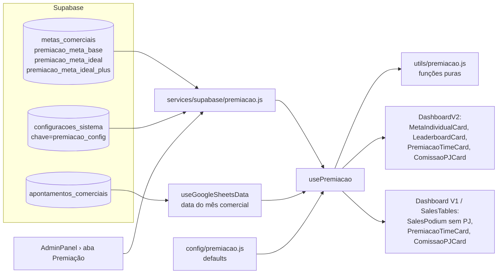

# Plano de Implementação — Metas, Premiação do Time e Comissão PJ

> Dashboard Comercial **existente** (V1 "Clássico" e V2 "Moderno"). Nada de dashboard novo: só cálculos e cards incorporados.
> **O projeto está em PRODUÇÃO.** Toda mudança deste plano é **aditiva**, fica atrás de um **feature flag** e **não exige DDL** (nenhum `ALTER TABLE`).

> **Status (23/09/2026):** Fases 0–8 implementadas na branch `feat/premiacao-metas` (16 casos do `scripts/validar-premiacao.mjs` OK, build OK, lint sem problemas novos). Pendente: **Fase 9** (homologação com login real) e merge/deploy.

---

## 0. Como usar este documento

1. As decisões da seção 3 foram **respondidas em 23/09/2026**. Só restam 2 confirmações menores (seção 3.1).
2. Siga as **Fases** (seção 6) na ordem. Cada fase termina com `npm run lint` + `npm run build` sem erros.
3. Marque os checkboxes `[ ]` → `[x]` conforme avança.
4. Só ligue o flag para todos depois da homologação (Fase 9).

---

## 1. Diagnóstico do Dashboard Comercial atual

### 1.1 Layouts e árvore de componentes

| Item | Situação |
|---|---|
| Layout ativo em produção | **V2 "Moderno"** (`configuracoes_sistema.chave='dashboard_layout'` = `moderno`) |
| V1 | [src/features/dashboard/components/Dashboard.jsx](src/features/dashboard/components/Dashboard.jsx) → `MainMetrics`, `Charts*`, `SalesTables` (→ `VendorSalesTable` + **`SalesPodium`**) |
| V2 | [src/features/dashboard-v2/DashboardV2.jsx](src/features/dashboard-v2/DashboardV2.jsx) → `MetaMesCard`, **`LeaderboardCard`** (top-3 com 🥇🥈🥉), **`MetaIndividualCard`**, `BadgesVendedor` (usa `useGamification`) |
| Dados | `useGoogleSheetsData(mês, ano)` (lê Supabase, não Sheets) → `data` já filtrado pelo **mês comercial** (dia 23 → dia 22) + `allData` |
| Processamento | `useDashboardData` → `processSheetData` → `dashboardData.vendedores` via `extractVendedores` ([src/utils/extractors.js](src/utils/extractors.js#L63-L117)) |

### 1.2 Campos monetários (`apontamentos_comerciais`)

| Conceito da regra | Coluna | Observação |
|---|---|---|
| **Entradas Líquidas** | `valor_entrada_servico` | Já é a base da "Meta de Entrada" e das medalhas V2 |
| **Valor Bruto de Contratos Fechados** | `valor_total_servico` | Hoje usado no pódio V1 e exibido como "Total" no V2 |
| Contrato fechado | `fase = 'CONTRATO/VENDA'` | Data da venda = `created_at` (não existe `data_fechamento`) |
| Registro válido | `ativo !== false` | `extractVendedores` **não** filtra `ativo`; o novo cálculo deve filtrar |

`extractMetaEntrada` usa *fallback* para `valor_total_servico` quando a entrada é 0 → **o cálculo de premiação NÃO deve usar esse fallback** (misturaria bruto com líquido).

### 1.3 Metas hoje

- Tabela `metas_comerciais (id, tipo_meta, valor_meta, mes, ano, ativo, observacoes, created_at, updated_at)`.
  - `UNIQUE (tipo_meta, mes, ano, ativo)`; **sem CHECK em `tipo_meta`** → novos tipos podem ser inseridos sem DDL.
  - Tipos existentes: `valor_entrada` (R$ 150.000 em jul–set/2026) e `clientes_atendidos` (250).
- Existe **uma única meta de valor** por mês. **Não há** Meta Base / Meta Ideal / Meta Ideal Plus.
- Leitura/gravação: [src/services/supabase/metas.js](src/services/supabase/metas.js) + [src/config/metas.js](src/config/metas.js).

**Problemas encontrados (não corrigir neste escopo, apenas NÃO reutilizar):**
1. `buscarMetasDoMes()` / `salvarMeta()` usam o **mês do relógio (1-based)**, não o mês comercial do filtro. Ex.: em 23/09/2026 o mês comercial vigente é **outubro**, mas a meta lida/gravada é `mes=9`.
2. [useMetaPersistence.js](src/features/dashboard/hooks/useMetaPersistence.js) **grava a meta a cada carregamento** do dashboard (por isso `observacoes = "Meta atualizada via App em …"` muda sempre).

➡️ As metas de premiação terão **tipos próprios** e serão lidas/gravadas com **mês/ano explícitos do mês comercial**, sem passar por `useMetaPersistence`.

### 1.4 Meta individual hoje

- [useGamification.js](src/features/dashboard-v2/hooks/useGamification.js#L33-L35) e [MetaIndividualCard.jsx](src/features/dashboard-v2/components/MetaIndividualCard.jsx#L26-L28): `metaTime / vendedores.length`.
- `vendedores.length` = **quem vendeu no período** (inclui o PJ e exclui quem não vendeu) → **divisor errado** para a nova regra.

### 1.5 Pódio

- **V1** [SalesPodium.jsx](src/components/SalesPodium.jsx#L50) pega os 3 primeiros de `dashboardData.vendedores` (ordenado por `valor_total_servico`) e **grava** `total_vendas_mes`, `comissao_mes = 1%`, `posicao_ranking` na tabela `vendedores` a cada render (fallback em [L106](src/components/SalesPodium.jsx#L106)).
- [PodiumCard.jsx](src/components/PodiumCard.jsx#L51) mostra "Comissão" fixa de 1%.
- **V2** [LeaderboardCard.jsx](src/features/dashboard-v2/components/LeaderboardCard.jsx#L15-L44): ranking por entrada; posições 1–3 com medalha de pódio.
- Tabela `vendedores` tem 3 registros *mock* + os 5 reais; **não tem** coluna de tipo (CLT/PJ).

### 1.6 Usuários ↔ vendedores (`usuarios.nome_vendedor_comercial`)

| Vendedor | Usuário | Ativo |
|---|---|---|
| EDGAR | Edgar da Silva Santos | ✅ |
| EDUARDA | Eduarda Alves de Paiva | ✅ |
| FÁBIO | "Administrador" | ✅ — **Líder** (fora de metas e premiação) |
| PAMELLI | Pamelli dos Santos Pacheco | ❌ **saiu da empresa** |
| VITOR | Vitor Foglia | ✅ — **PJ** |
| CAMILA | Camila Quintais | ✅ — efetiva (ainda sem apontamentos) |

V2 identifica o usuário por `nome_vendedor_comercial`; V1 (`VendorSalesTable`) pelo primeiro nome de `nome_completo`. **O novo código usa `nome_vendedor_comercial`.**

### 1.7 Snapshot real — Setembro/2026 comercial (23/08 → 22/09)

| Vendedor | Contratos | Entrada (líquida) | Bruto |
|---|---:|---:|---:|
| EDGAR | 9 | 38.766,66 | 83.950,00 |
| EDUARDA | 10 | 46.755,70 | 203.082,00 |
| VITOR (PJ) | 3 | 33.675,00 | 144.350,00 |
| FÁBIO / PAMELLI | 0 | 0 | 0 |

Meta de entrada do mês (`valor_entrada`, mes=9): **R$ 150.000**.

---

## 2. Regras formalizadas

Notação: todos os valores do **mês comercial selecionado no filtro**, somente `fase='CONTRATO/VENDA'` e `ativo !== false`.

```
EFETIVOS        = EDGAR, EDUARDA, CAMILA (lista de configuração, NÃO "quem vendeu")
                  fora: VITOR (PJ), FÁBIO (líder), PAMELLI (desligada)
MetaIndividual  = MetaIdeal ÷ |EFETIVOS|

EntradaLiq(v)   = Σ valor_entrada_servico do vendedor v
Bruto(v)        = Σ valor_total_servico   do vendedor v
Atingimento(v)  = EntradaLiq(v) ÷ MetaIndividual × 100
Elegível(v)     = v ∈ EFETIVOS  E  EntradaLiq(v) ≥ MetaIndividual

ResultadoTime   = Σ EntradaLiq(v) somente dos EFETIVOS (PJ e líder NÃO entram)

Nível (prêmio liberado editável por nível):
  ResultadoTime <  GatilhoBase                  → nenhum      → R$ 0
  GatilhoBase   ≤ ResultadoTime < MetaIdeal     → Meta Base   → R$ 1.500
  MetaIdeal     ≤ ResultadoTime < MetaIdealPlus → Meta Ideal  → R$ 3.000
  ResultadoTime ≥ MetaIdealPlus                 → Ideal Plus  → R$ 4.500
  GatilhoBase = MetaBase × (1 + gatilhoBasePct/100), gatilhoBasePct = 1

PremioLiberado  = premio[nivel]   (valor fixo configurado, não mais PremioBase × %)
PoolColetivo    = PremioLiberado × 30%
PoolPerformance = PremioLiberado × 70%

Para cada v Elegível (E = conjunto de elegíveis):
  ParcelaColetiva(v)   = PoolColetivo ÷ |E|
  Participação(v)      = Bruto(v) ÷ Σ Bruto(E)
  ParcelaPerformance(v)= PoolPerformance × Participação(v)
  PremioFinal(v)       = ParcelaColetiva(v) + ParcelaPerformance(v)
Não elegível → R$ 0 (independentemente do bruto)
PJ    → fora do divisor, do coletivo, do rateio e do pódio; só comissão própria
Líder → fora do divisor, do coletivo e do rateio
```

**Casos de borda (obrigatórios):**
- `|E| = 0` → prêmio liberado é exibido, mas **nada é distribuído** (mensagem "Nenhum vendedor elegível").
- `Σ Bruto(E) = 0` com `|E| > 0` → 70% dividido igualmente (evita divisão por zero).
- `MetaIdeal` ausente/0 ou `|EFETIVOS| = 0` → card exibe "Metas de premiação não configuradas para este mês" (sem cálculo).
- Arredondamento em **centavos inteiros**; a sobra de centavos vai para o elegível de maior participação, para que `Σ PremioFinal = PremioLiberado` exatamente.
- Comparações de elegibilidade e nível feitas em centavos (evita erro de ponto flutuante).
- Validação ao salvar: `MetaBase < MetaIdeal < MetaIdealPlus`.

### 2.1 Comissão PJ (Vitor)

| Faixa | De | Até | Alíquota |
|---|---:|---:|---:|
| 1 | R$ 0,01 | R$ 15.000,00 | 1,0% |
| 2 | R$ 15.000,01 | R$ 60.000,00 | 1,5% |
| 3 | R$ 60.000,01 | R$ 100.000,00 | 2,0% |
| 4 | R$ 100.000,01 | — | 2,5% |

Limites superiores **inclusivos** (resolve o "buraco" entre 15.000 e 15.001 do enunciado).
Base de cálculo: **valor bruto** (`valor_total_servico`). Modo: ver 3.1.

---

## 3. Decisões (respondidas em 23/09/2026)

| # | Tema | **Decisão** |
|---|---|---|
| **D1** | Entradas Líquidas | `valor_entrada_servico` (coluna pura, sem descontos) |
| **D2** | Vendedores efetivos (divisor) | **EDGAR, EDUARDA, CAMILA**. PAMELLI saiu da empresa. **FÁBIO é líder**: pode vender, mas não entra em metas, divisor, coletivo nem rateio |
| **D3** | Coletivo inclui o PJ? | **Não.** Vendas do Vitor contam só para a comissão dele |
| **D4** | Gatilho da Meta Base | **`≥ Meta Base × 1,01`** (`gatilhoBasePct = 1`, editável) |
| **D5** | Prêmio liberado por nível | **Meta Base R$ 1.500 · Meta Ideal R$ 3.000 · Meta Ideal Plus R$ 4.500**, todos **editáveis** na aba admin |
| **D6** | Prêmio por time | Valor único, rateado entre os elegíveis (30% igual / 70% pelo bruto) |
| **D7** | Base da comissão PJ | **Valor bruto** (`valor_total_servico`) |
| **D8** | Modo da comissão PJ | Ver 3.1 (default: faixa atingida sobre o total, editável) |
| **D9** | Meta Ideal | Tipo próprio `premiacao_meta_ideal`, pré-preenchido com `valor_entrada` do mês |
| **D10** | Visibilidade | Admin vê tudo. Vendedor efetivo vê o nível coletivo, o prêmio liberado e **só a própria linha**. Card PJ: **admin + o próprio PJ** |
| **D11** | PJ no ranking V2 / medalhas | Fora do `LeaderboardCard` (pódio do V2) e sem medalha. Continua no `VendorSalesTable` (relatório) |
| **D12** | Comissão 1% do `PodiumCard` | Mantida (fora do escopo) |

### 3.1 Confirmações menores (não bloqueiam; defaults já no plano)
- **Modo da comissão PJ:** a alíquota da faixa atingida vale sobre **todo** o bruto (Set/2026: 144.350 × 2,5% = R$ 3.608,75), ou é **progressiva**, com cada faixa só sobre a sua parte (R$ 2.733,75)? Default: **faixa atingida**, trocável na config.
- **FÁBIO no pódio V1 / ranking V2:** o pedido só tira o Vitor. Default: **Fábio continua** no pódio e no ranking, mas sem meta individual, medalha nem prêmio.

---

## 4. Arquitetura da solução



### 4.1 Persistência — sem DDL

| Dado | Onde | Chave |
|---|---|---|
| Meta Base / Ideal / Ideal Plus (por mês) | `metas_comerciais` (novas linhas) | `tipo_meta` = `premiacao_meta_base` · `premiacao_meta_ideal` · `premiacao_meta_ideal_plus`; `mes` = **mês comercial 1-based** (`mesSel + 1`), `ano` = ano comercial |
| Parâmetros gerais + prêmios por nível + classificação (Efetivo/PJ/Líder/Desligado) + faixas PJ | `configuracoes_sistema` | `chave = 'premiacao_config'`, `valor` = JSON |

O listener realtime do [LayoutContext.jsx](src/contexts/LayoutContext.jsx#L67-L68) filtra por `chave === 'dashboard_layout'`, então uma nova chave **não interfere** no layout.

Formato do JSON `premiacao_config`:

```json
{
  "habilitado": false,
  "visibilidade": "admin",
  "gatilhoBasePct": 1,
  "premios": { "base": 1500, "ideal": 3000, "ideal_plus": 4500 },
  "distribuicao": { "coletivo": 0.30, "performance": 0.70 },
  "vendedores": {
    "EDGAR": "EFETIVO", "EDUARDA": "EFETIVO", "CAMILA": "EFETIVO",
    "FÁBIO": "LIDER", "PAMELLI": "DESLIGADO", "VITOR": "PJ"
  },
  "comissaoPJ": {
    "base": "valor_total_servico",
    "modo": "faixa_atingida",
    "faixas": [
      { "ate": 15000, "pct": 1.0 },
      { "ate": 60000, "pct": 1.5 },
      { "ate": 100000, "pct": 2.0 },
      { "ate": null, "pct": 2.5 }
    ]
  }
}
```

- `habilitado=false` → nenhum card novo aparece e nada muda para os usuários (rollback instantâneo).
- `visibilidade`: `"admin"` (homologação) → `"todos"` (liberado, respeitando D10).
- `vendedores`: `EFETIVO` (divisor + coletivo + rateio) · `PJ` (só comissão, fora do pódio) · `LIDER` (fora de tudo da premiação) · `DESLIGADO` (ignorado). Nome não listado = tratado como `LIDER` (fora da premiação) e aparece na aba admin para ser classificado.
- Nomes comparados com `toUpperCase().trim()` (mantendo acentos, como em `proprietario_relacionamento`: `FÁBIO`).

### 4.2 Arquivos

**Novos**
| Arquivo | Responsabilidade |
|---|---|
| `src/config/premiacao.js` | `PREMIACAO_DEFAULTS` (JSON acima) e constantes de `tipo_meta` |
| `src/utils/premiacao.js` | Funções **puras** (sem React/Supabase): `agregarPorVendedor`, `calcularMetaIndividual`, `calcularNivelColetivo`, `distribuirPremio`, `calcularComissaoPJ`, `calcularPremiacao` |
| `src/services/supabase/premiacao.js` | `obterConfigPremiacao`, `salvarConfigPremiacao`, `buscarMetasPremiacao(ano, mes)`, `salvarMetasPremiacao(ano, mes, {base, ideal, plus})` — envolvido por `wrapServiceWithImpersonationGuard` |
| `src/features/dashboard/hooks/usePremiacao.js` | Carrega config + metas do mês, chama `calcularPremiacao(data, …)`; recarrega no evento `premiacao-config-updated` |
| `src/components/premiacao/PremiacaoTimeCard.jsx` | Nível coletivo + prêmio liberado + tabela de distribuição (compartilhado V1/V2) |
| `src/components/premiacao/ComissaoPJCard.jsx` | Barra de progresso por faixas do PJ (compartilhado V1/V2) |
| `src/components/PremiacaoTab.jsx` | Aba admin: metas do mês + prêmios por nível + classificação dos vendedores + parâmetros + flag |
| `scripts/validar-premiacao.mjs` | Script `node` com os casos da seção 7 (sem dependências novas) |

**Alterados (mudança mínima)**
| Arquivo | Mudança |
|---|---|
| [src/services/index.js](src/services/index.js) | + export do `premiacaoService` |
| [src/features/dashboard-v2/DashboardV2.jsx](src/features/dashboard-v2/DashboardV2.jsx) | chamar `usePremiacao`; passar `premiacao` aos cards; renderizar os 2 cards novos |
| [MetaIndividualCard.jsx](src/features/dashboard-v2/components/MetaIndividualCard.jsx) | quando `premiacao.ativo`: meta individual correta, listar **todos os efetivos** (inclusive quem tem R$ 0), sem PJ, + colunas de elegibilidade/prêmio |
| [LeaderboardCard.jsx](src/features/dashboard-v2/components/LeaderboardCard.jsx) | filtrar PJ quando `premiacao.ativo` |
| [useGamification.js](src/features/dashboard-v2/hooks/useGamification.js) | usar `premiacao.metaIndividual` quando disponível; PJ e líder sem medalha |
| [src/features/dashboard/components/Dashboard.jsx](src/features/dashboard/components/Dashboard.jsx) + [SalesTables.jsx](src/features/dashboard/components/SalesTables.jsx) | chamar `usePremiacao`; filtrar PJ do `SalesPodium`; renderizar os 2 cards abaixo do pódio |
| [SalesPodium.jsx](src/components/SalesPodium.jsx) | nenhuma mudança interna: recebe `vendedoresReais` **já sem PJ** |
| [AdminPanel.jsx](src/components/AdminPanel.jsx#L365) | + aba `premiacao` (só admin) ao lado de "Aparência" |

**Regra de ouro:** com `habilitado=false` (ou config ausente), todo componente alterado deve se comportar **exatamente** como hoje.

---

## 5. Exemplos numéricos (usar como referência nos testes)

### 5.1 Setembro/2026 real com as regras decididas
Meta Ideal = 150.000 · efetivos = EDGAR, EDUARDA, CAMILA → **Meta Individual = R$ 50.000** (hipótese: Meta Base = 100.000 → gatilho 101.000; Meta Ideal Plus = 200.000).

| Vendedor | Entrada líquida | Atingimento | Elegível |
|---|---:|---:|---|
| EDGAR | 38.766,66 | 77,5% | ❌ |
| EDUARDA | 46.755,70 | 93,5% | ❌ |
| CAMILA | 0,00 | 0% | ❌ |
| VITOR (PJ) | — | — | fora (comissão) |
| FÁBIO (líder) | — | — | fora |

Resultado coletivo = 85.522,36 < 101.000 → **nenhum nível, R$ 0 liberado**.

### 5.2 Distribuição (hipotético: nível Meta Ideal → liberado R$ 3.000)
Elegíveis: EDGAR (bruto 83.950) e EDUARDA (bruto 203.082) → Σ bruto = 287.032.

| | Coletiva (30% = 900 ÷ 2) | Participação | Performance (70% = 2.100) | **Prêmio final** |
|---|---:|---:|---:|---:|
| EDGAR | 450,00 | 29,25% | 614,20 | **1.064,20** |
| EDUARDA | 450,00 | 70,75% | 1.485,80 | **1.935,80** |
| CAMILA (não elegível) | 0 | — | 0 | **0,00** |
| **Total** | 900,00 | 100% | 2.100,00 | **3.000,00** |

### 5.3 Comissão PJ — Vitor, Setembro/2026 (base = bruto 144.350,00)
| Modo faixa atingida (default) | Modo progressivo |
|---|---|
| faixa 4 → 2,5% = **R$ 3.608,75** | 150 + 675 + 800 + 1.108,75 = **R$ 2.733,75** |

---

## 6. Passo a passo

### Fase 0 — Preparação (segurança em produção)
- [ ] Criar branch `feat/premiacao-metas` (nada direto na `main`).
- [ ] Registrar o estado atual (somente leitura) para comparação:
  - `select * from metas_comerciais where ano = 2026 order by mes, tipo_meta;`
  - `select * from configuracoes_sistema;`
- [ ] Confirmar que **não há CHECK** em `metas_comerciais.tipo_meta` (✅ verificado em 23/09/2026).
- [x] Responder D1–D12 (23/09/2026). Confirmar os 2 itens da seção 3.1 (opcional; defaults valem).
- [ ] Rodar `npm run lint` e `npm run build` na branch limpa para ter a linha de base.

### Fase 1 — Configuração
- [ ] Criar `src/config/premiacao.js` com `PREMIACAO_DEFAULTS` (`habilitado: false`) e `TIPOS_META_PREMIACAO = { base, ideal, plus }`.
- [ ] Função `mesclarConfig(salva)` = defaults + JSON salvo (tolerante a JSON inválido → defaults + `console.warn`).

### Fase 2 — Motor de cálculo puro (`src/utils/premiacao.js`)
- [ ] `normalizarNome(n)` → `String(n || '').toUpperCase().trim()`.
- [ ] `agregarPorVendedor(data)` → `{ [nome]: { entrada, bruto, contratos } }` com `fase === 'CONTRATO/VENDA' && ativo !== false`, **sem fallback** entrada→bruto.
- [ ] `calcularMetaIndividual(metaIdeal, efetivos)`.
- [ ] `classificar(nome, config)` → `EFETIVO | PJ | LIDER | DESLIGADO` (default `LIDER`).
- [ ] `calcularNivelColetivo(total, { base, ideal, plus }, gatilhoBasePct, premios)` → `{ id, premio, proximoNivel, faltaParaProximo }`.
- [ ] `distribuirPremio(liberado, elegiveis, { coletivo, performance })` em centavos, com ajuste de sobra (seção 2).
- [ ] `calcularComissaoPJ(valor, { faixas, modo })` → `{ faixaAtual, pct, comissao, proximaFaixa, faltaParaProxima, progressoNaFaixa }`.
- [ ] `calcularPremiacao({ data, metas, config })` → objeto único:
  ```js
  {
    configurado, metaIndividual, efetivos, resultadoColetivo,
    nivel, premioLiberado, poolColetivo, poolPerformance,
    linhas: [{ nome, entrada, bruto, atingimento, elegivel, participacao,
               parcelaColetiva, parcelaPerformance, premioFinal }],
    pjs: [{ nome, base, faixa, pct, comissao, proximaFaixa, faltaParaProxima }]
  }
  ```
- [ ] Criar `scripts/validar-premiacao.mjs` (importa `src/utils/premiacao.js` e usa `node:assert`) com os casos da seção 7. Rodar: `node scripts/validar-premiacao.mjs`.

### Fase 3 — Serviço (`src/services/supabase/premiacao.js`)
- [ ] `obterConfigPremiacao()` → `configuracoesService.obterConfiguracao('premiacao_config')` + `JSON.parse` seguro.
- [ ] `salvarConfigPremiacao(config, atualizadoPor)` → `salvarConfiguracao('premiacao_config', JSON.stringify(config), …)`.
- [ ] `buscarMetasPremiacao(ano, mes1a12)` → um `select` em `metas_comerciais` com `tipo_meta in (...)`, `mes`, `ano`, `ativo = true`.
- [ ] `salvarMetasPremiacao(ano, mes1a12, { base, ideal, plus })` → reutiliza `metasService.salvarMeta(tipo, valor, mes, ano, obs)` **sempre com mês/ano explícitos**; valida `base < ideal < plus` antes.
- [ ] Envolver com `wrapServiceWithImpersonationGuard` (bloqueia escrita durante impersonação).
- [ ] Exportar em [src/services/index.js](src/services/index.js).
- [ ] **Não** alterar `metas.js`, `config/metas.js` nem `useMetaPersistence.js`.

### Fase 4 — Hook `usePremiacao`
- [ ] Assinatura: `usePremiacao({ data, ano, mes })` (`mes` 0-based como no dashboard; converter para `mes + 1` ao buscar metas).
- [ ] Carrega config e metas no mount e ao mudar `ano/mes`; escuta `window` `premiacao-config-updated`.
- [ ] Retorna `{ ativo, loading, erro, config, resultado, podeVer(nome) }`, onde `ativo = config.habilitado && (visibilidade === 'todos' || isAdmin())`.
- [ ] `useMemo` sobre `calcularPremiacao` (depende de `data`, metas, config).
- [ ] Falha de rede → `ativo = false` (dashboard continua como hoje).

### Fase 5 — Admin: aba "Premiação"
- [ ] Criar `src/components/PremiacaoTab.jsx` e registrá-la em [AdminPanel.jsx](src/components/AdminPanel.jsx#L365) (botão + bloco `activeTab === 'premiacao'`, igual a "Aparência" em [L896](src/components/AdminPanel.jsx#L896)).
- [ ] Seção **Metas do mês comercial**: seletor mês/ano (default = mês comercial vigente) + Meta Base / Meta Ideal / Meta Ideal Plus. Meta Ideal pré-preenchida com `valor_entrada` do mesmo mês se ainda não existir (D9).
- [ ] Seção **Vendedores**: lista de `proprietario_relacionamento` distintos + usuários com `nome_vendedor_comercial`; para cada um, um seletor `Efetivo / PJ / Líder / Desligado`. O contador "N efetivos → Meta Individual R$ X" atualiza ao vivo.
- [ ] Seção **Prêmios por nível** (editáveis): Meta Base R$ 1.500 · Meta Ideal R$ 3.000 · Meta Ideal Plus R$ 4.500. Validar valores ≥ 0 e crescentes.
- [ ] Seção **Parâmetros**: gatilho da Meta Base (% acima, default 1), 30/70, faixas PJ, modo e base da comissão PJ.
- [ ] Seção **Publicação**: `habilitado` + `visibilidade` (admin / todos).
- [ ] Salvar só por clique explícito (nada de auto-save), mostrando quem/quando salvou (`atualizado_por/atualizado_em`); disparar `premiacao-config-updated`.

### Fase 6 — V2 (layout ativo)
- [ ] [DashboardV2.jsx](src/features/dashboard-v2/DashboardV2.jsx): `const premiacao = usePremiacao({ data, ano: anoSel, mes: mesSel })`; passar a `MetaIndividualCard`, `LeaderboardCard`, `useGamification`/`BadgesVendedor`.
- [ ] **MetaIndividualCard** (quando `premiacao.ativo`):
  - Meta Individual = `resultado.metaIndividual`; rodapé: "Meta Ideal R$ X ÷ N vendedores efetivos (PJ não entra)".
  - Linhas = só os `EFETIVO` (EDGAR, EDUARDA, CAMILA), inclusive quem está com R$ 0; sem PJ nem líder.
  - Colunas: Entrada líquida · **% atingimento** · **Elegível ✅/❌** · Bruto · **Participação** · **Parcela coletiva** · **Parcela performance** · **Prêmio final**.
  - Não-admin: só a própria linha (comportamento atual preservado).
- [ ] **LeaderboardCard**: `vendedores.filter(v => classificar(v.vendedor) !== 'PJ')` antes do ranking (PJ fora do pódio 🥇🥈🥉; FÁBIO continua, sem medalha — ver 3.1).
- [ ] **useGamification**: `metaIndividual = premiacao?.resultado?.metaIndividual ?? metaTime / qtdVendedores`; se o usuário não for `EFETIVO` → `medalhaAtual = null` e sem badge "Meta batida".
- [ ] **PremiacaoTimeCard** (nova linha logo abaixo do `MetaIndividualCard`):
  - Resultado coletivo vs Meta Base / Ideal / Ideal Plus numa barra com 3 marcadores.
  - Nível atingido (Nenhum / Meta Base / Meta Ideal / Meta Ideal Plus) + "faltam R$ X para o próximo nível (+R$ Y de prêmio)".
  - **Prêmio total liberado**, pool coletivo (30%) e pool performance (70%).
  - Nº de elegíveis e tabela resumo (admin).
  - Selo "Prévia — mês em andamento" enquanto o mês comercial não fechou.
- [ ] **ComissaoPJCard** (seção "Parceiros PJ", abaixo do PremiacaoTimeCard) — ver Fase 8.

### Fase 7 — V1 (Clássico)
- [ ] [Dashboard.jsx](src/features/dashboard/components/Dashboard.jsx): `usePremiacao({ data, ano, mes })` (converter `selectedMonth`/`selectedYear` como o V2 faz) e passar a `SalesTables`.
- [ ] [SalesTables.jsx](src/features/dashboard/components/SalesTables.jsx): `vendedoresPodio = premiacao.ativo ? vendedores.filter(semPJ) : vendedores` → `<SalesPodium vendedoresReais={vendedoresPodio} />`. `VendorSalesTable` continua recebendo a lista completa.
- [ ] Abaixo do pódio: `<PremiacaoTimeCard />` e `<ComissaoPJCard />` (mesmos componentes do V2).

### Fase 8 — Seção PJ com barra de progresso (`ComissaoPJCard`)
- [ ] Um bloco por vendedor PJ do mês (hoje: VITOR). Aparece mesmo com R$ 0 vendido.
- [ ] Barra segmentada em 4 faixas com marcadores em **15k / 60k / 100k**; escala até `max(120.000, valor × 1,1)`; cor por faixa.
- [ ] Mostrar: valor-base acumulado · faixa atual e alíquota · **comissão acumulada** · "faltam R$ X para 1,5% / 2% / 2,5%" · na última faixa: "Faixa máxima atingida".
- [ ] Tooltip/legenda com a tabela de faixas e o modo (D8).
- [ ] Visibilidade: admin + o próprio PJ (`usuario.nome_vendedor_comercial`) (D10).

### Fase 9 — Validação e liberação
- [ ] `node scripts/validar-premiacao.mjs` ✅
- [ ] `npm run lint` e `npm run build` sem erros novos.
- [ ] `npm run dev` com `habilitado=false`: V1 e V2 **idênticos** ao atual (pódio, ranking, medalhas, metas).
- [ ] Admin cadastra metas do mês comercial vigente e salva config com `habilitado=true`, `visibilidade='admin'`.
- [ ] Conferir os números na tela com a query de conferência abaixo e com a seção 5.
- [ ] Testar como vendedor efetivo (impersonação), como VITOR e como FÁBIO: cada um vê só o que D10 permite.
- [ ] Testar troca de mês no filtro (mês sem metas → "não configurado"; mês antigo → valores do mês).
- [ ] Testar layout V1 via aba "Aparência" e voltar para V2.
- [ ] Liberar: `visibilidade='todos'`.

Query de conferência (somente leitura; ajustar o intervalo do mês comercial):
```sql
select proprietario_relacionamento,
       count(*)                   as contratos,
       sum(valor_entrada_servico) as entrada_liquida,
       sum(valor_total_servico)   as bruto
from apontamentos_comerciais
where fase = 'CONTRATO/VENDA'
  and coalesce(ativo, true)
  and created_at >= '2026-09-23 00:00:00-03'
  and created_at <  '2026-10-23 00:00:00-03'
group by 1 order by 1;
```

### Fase 10 — Rollback
- Imediato, sem deploy: `premiacao_config.habilitado = false` pela aba Premiação.
- Código: reverter o merge da branch (as metas `premiacao_*` e a chave `premiacao_config` podem ficar no banco; nada as lê fora do código novo).

---

## 7. Casos de teste (`scripts/validar-premiacao.mjs`)

| # | Cenário | Esperado |
|---|---|---|
| T1 | Resultado < gatilho base | nenhum nível, liberado 0, todos R$ 0 |
| T2 | Resultado = MetaBase exato, `gatilhoBasePct=1` | nenhum · com `gatilhoBasePct=0` → R$ 1.500 |
| T3 | Resultado = MetaIdeal − 0,01 | R$ 1.500 |
| T4 | Resultado = MetaIdeal | R$ 3.000 |
| T5 | Resultado = MetaIdealPlus | R$ 4.500 |
| T6 | Entrada = MetaIndividual exata | elegível |
| T7 | Entrada = MetaIndividual − 0,01 com bruto alto | não elegível, R$ 0 |
| T8 | Nenhum elegível | distribuição vazia, soma 0 |
| T9 | Elegíveis com bruto total 0 | 70% dividido igualmente |
| T10 | Exemplo 5.2 | 1.064,20 / 1.935,80 / soma 3.000,00 |
| T11 | 3 elegíveis com rateio gerando dízima | Σ prêmios = liberado (centavo a centavo) |
| T12 | PJ com entrada acima da meta | fora dos elegíveis, do divisor e do coletivo |
| T12b | Líder (FÁBIO) com vendas | fora dos elegíveis, do divisor e do coletivo |
| T12c | Efetiva sem vendas (CAMILA) | conta no divisor, não elegível, R$ 0 |
| T12d | Prêmios editados (ex.: 2.000/4.000/6.000) | liberado segue os novos valores |
| T13 | Comissão PJ: 0 · 15.000 · 15.000,01 · 60.000 · 100.000 · 100.000,01 · 144.350 | 0 · 1% · 1,5% · 1,5% · 2% · 2,5% · conforme 5.3 |
| T14 | Registro `ativo=false` e fase ≠ CONTRATO/VENDA | ignorados |
| T15 | Nome com espaço/minúscula (`" vitor"`) | reconhecido como VITOR |
| T16 | Config ausente/JSON inválido | defaults, `habilitado=false` |

---

## 8. Riscos e mitigação

| Risco | Mitigação |
|---|---|
| Quebrar telas em produção | Feature flag desligado por padrão; componentes alterados mantêm caminho antigo quando `!premiacao.ativo` |
| Mês das metas errado (relógio × comercial) | Metas de premiação com tipo próprio e `mes`/`ano` explícitos do mês comercial |
| Auto-save de `useMetaPersistence` sobrescrever metas | Tipos `premiacao_*` não são tocados por ele |
| Divisor mudar sozinho conforme quem vendeu | Divisor = vendedores classificados como `EFETIVO` na config |
| Alterar config muda o cálculo de meses passados | Aceito nesta versão (tudo é "prévia"). Evolução: snapshot mensal do fechamento |
| Exposição de valores de prêmio/comissão | Filtro de visibilidade no front (D10). **Atenção:** RLS está OFF no projeto — o dado de config fica legível pela anon key; não há dados pessoais sensíveis além de valores de prêmio |
| Escrita durante impersonação | `wrapServiceWithImpersonationGuard` no novo serviço |
| Nova chave em `configuracoes_sistema` afetar o layout | Listener já filtra `chave === 'dashboard_layout'` |

---

## 9. Fora do escopo (registrar como melhorias futuras)
- Corrigir `buscarMetasDoMes`/`salvarMeta` para usar o mês comercial e remover o auto-save de `useMetaPersistence`.
- `SalesPodium` gravar na tabela `vendedores` a cada render; limpar os 3 registros *mock*.
- Comissão fixa de 1% do `PodiumCard`.
- Fechamento mensal com snapshot (tabela `premiacao_fechamentos`) e exportação para folha.
- Habilitar RLS nas tabelas públicas.
